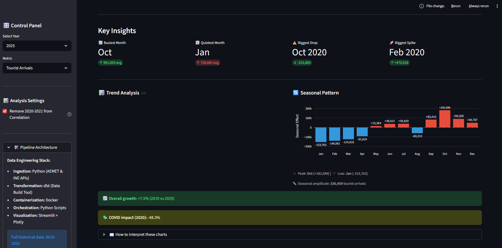
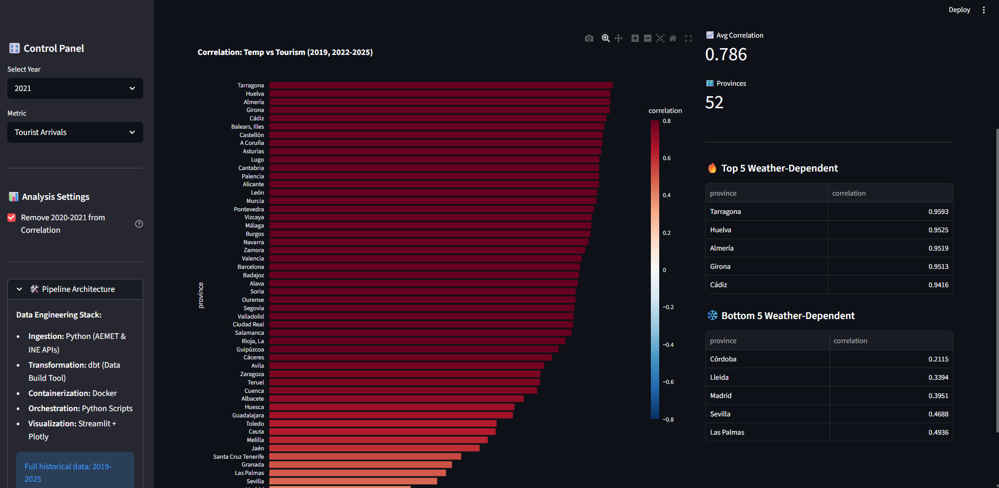
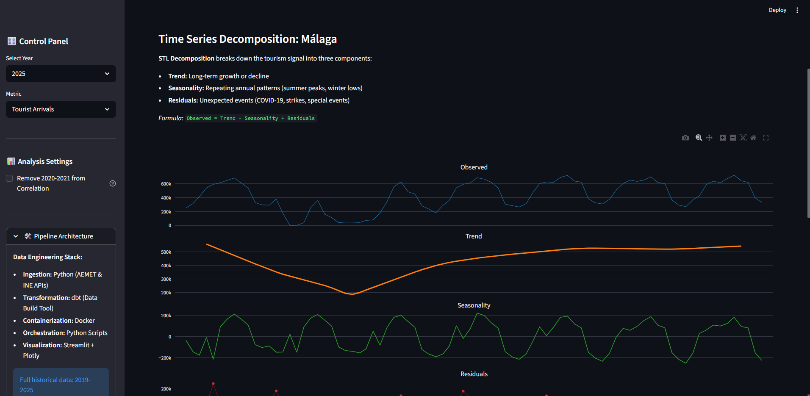
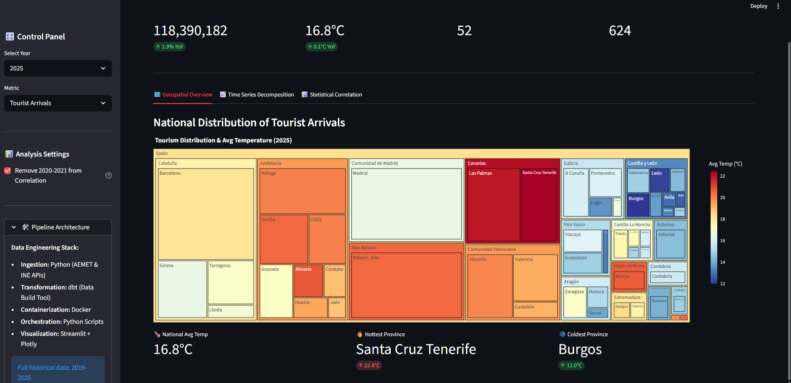
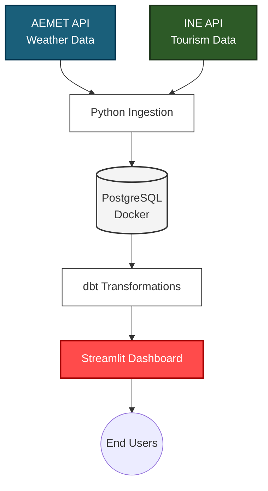

# Spain Climate & Tourism Intelligence Dashboard

[](https://spain-climate-tourism-pipeline-lugpwg78nmzwvht3itdjqh.streamlit.app)


An end-to-end data engineering pipeline analyzing the correlation between meteorological conditions and tourism demand across Spanish provinces.

**[View Live Dashboard](https://spain-climate-tourism-pipeline-lugpwg78nmzwvht3itdjqh.streamlit.app)**

## Dashboard Preview

| Key Insights | Correlation Analysis |
|---|---|
|  |  |

| Time Series | Geographic Distribution |
|---|---|
|  |  | 


## Project Overview

This project extracts, transforms, and visualizes tourism and weather data from official Spanish government sources to answer a fundamental question: **Does temperature drive tourism in Spain?**

By analyzing data from 52 provinces over 7 years (2019-2025), this pipeline reveals regional patterns, seasonal behaviors, and unexpected correlations.

## 📊 Key Insights

- **Thermal Correlation**: Temperature correlates strongly with tourism in coastal provinces ($r > 0.7$), while inland cities like Madrid or Córdoba show much lower weather dependency.
- **Structural Breaks**: The COVID-19 impact is clearly visible in 2020 as a significant anomaly that disrupted historical trends across all regions.
- **Rigid Seasonality**: We observe clear seasonality in every province. While climate is a driver, local festivities and institutional holidays show an impact on the "Seasonal" component of the STL decomposition.
- **Climatic Outliers**: The Canary Islands remain an outlier with high tourism levels year-round due to stable, mild temperatures during the European winter.

## Key Features
- **Automated data ingestion** from AEMET (Spanish Meteorological Agency) and INE (National Statistics Institute)
- **Time series decomposition** using STL to separate trend, seasonality, and anomalies
- **Provincial-level correlation analysis** between temperature and tourist arrivals
- **Interactive visualizations** with drill-down capabilities and comparative metrics

## Architecture


The application features an adaptive data layer. It detects the environment to prioritize a PostgreSQL connection during local development or fallback to a high-performance Parquet file when deployed to Streamlit Cloud.

## Tech Stack

| Layer | Technology | Purpose |
|-------|------------|---------|
| **Ingestion** | Python, Requests | Extract data from AEMET & INE APIs |
| **Storage** | PostgreSQL, Docker | Store raw and processed data |
| **Transformation** | dbt (Data Build Tool), SQL | Clean, transform, and model data |
| **Visualization** | Streamlit, Plotly | Interactive dashboard |
| **Analysis** | statsmodels (STL) | Time series decomposition |

## Data Sources

| Source | Description | Coverage |
|--------|-------------|----------|
| [AEMET OpenData](https://opendata.aemet.es/) | Temperature, precipitation by province | 2019-2025 |
| [INE](https://www.ine.es/) | Tourist arrivals and overnight stays | 2019-2025 |

## Project Structure

```
spain-climate-tourism-pipeline/
├── dashboard/
│   ├── app.py                            # Streamlit application
│   └── mart_weather_tourism.parquet      # Processed data
├── ingestion/
│   ├── aemet.py                          # Weather data extraction
│   ├── ine.py                            # Tourism data extraction
│   ├── load_to_postgres.py               # Database loader
│   ├── main_ingest.py                    # Pipeline orchestration
│   └── utils.py                          # Database utilities
├── dbt/
│   ├── dbt_project.yml                   # Project configuration
│   ├── models/
│   │    ├── staging/                     # Raw data cleaning
│   │    └── marts/                       # Final model
│   └── seeds/                            # Static mapping (province_mapping.csv)
├── docs/images                           # Dashboard Screenshots
├── export_data.py                        # SQL to Parquet exporter
├── docker-compose.yml                    # PostgreSQL container
├── requirements.txt                      # Production dependencies
└── requirements-local.txt                # Local development dependencies
```

## Getting Started

### Prerequisites
- Python 3.9+
- Docker & Docker Compose
- An [AEMET API Key](https://opendata.aemet.es/centrodedescargas/altaUsuario)

### Installation

1. Clone the repository
```bash
   git clone https://github.com/tu-usuario/spain-climate-tourism-pipeline.git
   cd spain-climate-tourism-pipeline
```

2. Install dependencies
```bash
   pip install -r requirements-local.txt
```

3. Create a `.env` file in the root directory:
```env
AEMET_API_KEY=your_api_key_here
POSTGRES_HOST=localhost
POSTGRES_PORT=5432
POSTGRES_DB=spain_tourism
POSTGRES_USER=postgres
POSTGRES_PASSWORD=your_password
```

4. Start PostgreSQL
```bash
   docker-compose up -d
```

5. Run the ingestion pipeline
```bash
   python ingestion/main_ingest.py
```

6. Run dbt transformations
```bash
   cd dbt
   dbt seed
   dbt run
   cd ..
```

7. Launch the dashboard
```bash
   streamlit run dashboard/app.py
```
## Contributing
Contributions are welcome! Feel free to open an issue or submit a pull request.

## License
Distributed under the MIT License. See `LICENSE` for more information.